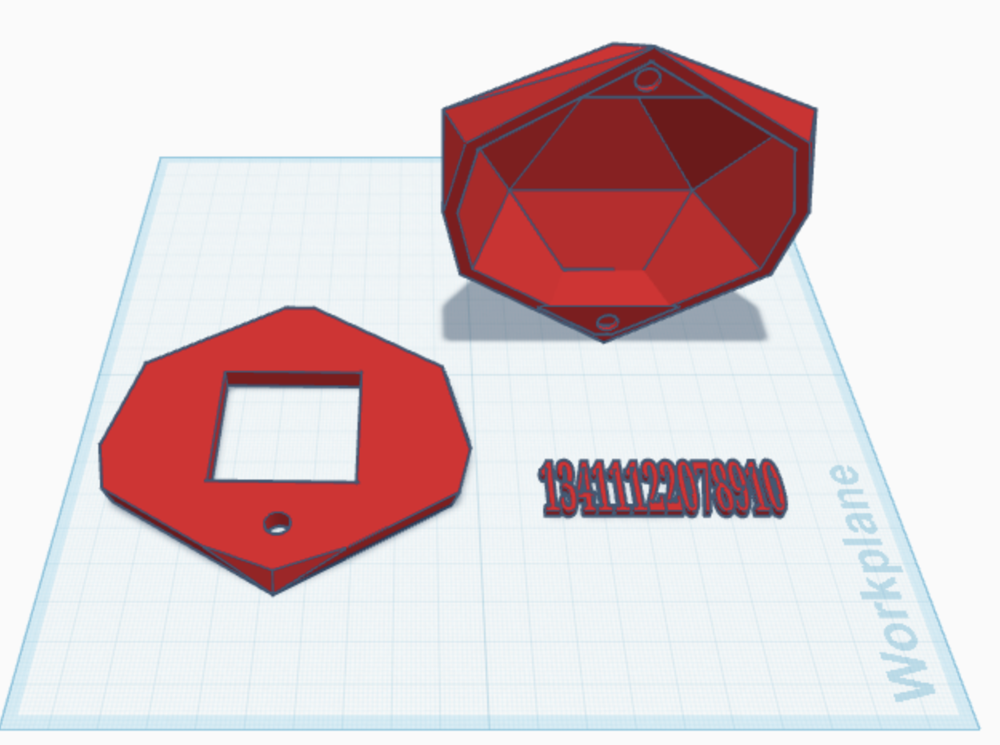

# E-Paper Dice 🎲

An ESP32-based e-paper dice project built from scratch as my first project as a Computer Science student.

The core logic is written in C++, while the display bitmaps are handled in C for performance and compatibility.

---

## Preview

---

## Features

- Clean and responsive menu system  
- Sound toggle option using a passive buzzer  
- **Custom Mode** – Roll a die with an upper limit of 20  
- **Classic Mode** – Roll a standard 6-sided die  
- Rotary encoder navigation  

---

## Hardware

- ESP32 Dev Board  
- 1.54" E-Paper Display  
- Rotary Encoder  
- Passive Buzzer  

---

## Inspiration

This project was inspired by the video game *Astrea: Six-Sided Oracles*.  
I really enjoyed the dice-based combat system and wanted to build a physical digital dice of my own.

Working within the limitations of an e-paper display pushed me to think creatively and improve my understanding of embedded systems and structured C++ design.

---

## Enclosure Development

I am currently designing a custom 3D-printed housing for the device.  
The STL file for the enclosure is included in this repository.

---

## Current Status

The project is actively being improved and refined.

---

## 👨‍💻 Author

Tony Atme